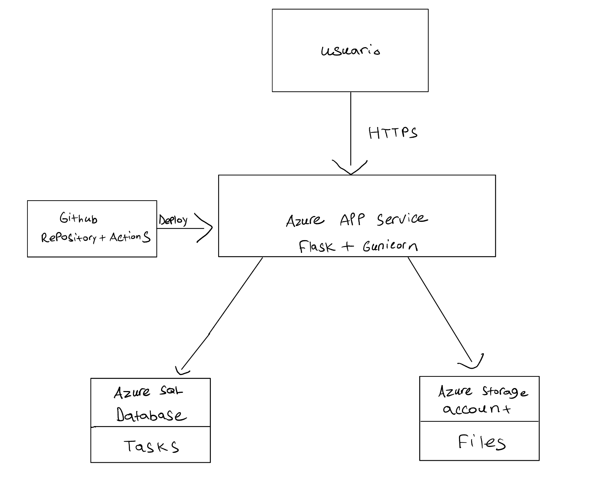

# Web App utilizando los servicios de Microsoft Azure
**Janiel Rodríguez Velázquez**  
COMP 4260

---

## Descripción General

Aplicación CRUD desplegada en Microsoft Azure que permite a los usuarios gestionar tareas pendientes de forma sencilla e intuitiva. Está dirigida a cualquier persona que quiera organizar sus actividades diarias, con la flexibilidad de adjuntar archivos a cada tarea.

Funcionalidades principales:
- Añadir tareas en formato de texto con archivo adjunto opcional
- Marcar tareas como completadas
- Eliminar tareas
- Visualizar todas las tareas activas y completadas

---

## Servicios de Azure Utilizados

| Servicio | Propósito |
|----------|-----------|
| Azure App Service | Servidor que contiene la aplicación y la ejecuta |
| Azure SQL Database | Almacena los datos del CRUD (tareas, estado, URL de archivo) |
| Azure Storage Account | Almacena los archivos adjuntos subidos por los usuarios |

---

## Diagrama de Arquitectura



---

## Despliegue y Configuración

### 1. Preparación Local

**Requisitos previos:**
- Python 3.13 o superior
- [Homebrew](https://brew.sh/) (solo macOS)
- ODBC Driver 18 para SQL Server

**Instalación del ODBC Driver 18 (macOS):**
```bash
brew tap microsoft/mssql-release https://github.com/Microsoft/homebrew-mssql-release
brew update
brew install msodbcsql18
```

**Pasos para correr el proyecto localmente:**

1. Clonar el repositorio:
```bash
git clone https://github.com/Janielrodz/proyecto_final_comp4260
cd proyecto_final_comp4260
```

2. Crear y activar el entorno virtual:
```bash
python3 -m venv venv
source venv/bin/activate
```

3. Instalar dependencias:
```bash
pip install -r requirements.txt
```

4. Crear el archivo `.env` dentro de `azure_students_project/` con las siguientes variables:
- SQL_SERVER=tu-servidor.database.windows.net
- SQL_DATABASE=nombre_base_datos
- SQL_USERNAME=usuario
- SQL_PASSWORD=contraseña
- AZURE_STORAGE_CONNECTION_STRING=tu-connection-string

5. Correr la aplicación:
```bash
python3 azure_students_project/app.py
```

6. Acceder desde el navegador en `http://localhost:5000`

> **Nota:** Para conectarte a la base de datos local, asegúrate de que tu IP esté registrada en las reglas de firewall del SQL Server en Azure Portal.

---

### 2. Configuración en Azure

**Azure SQL Server y Database:**
- Servidor creado en la región Brazil South
- Base de datos `comp4260_database` creada bajo el servidor `comp4260server`
- Firewall configurado para permitir la IP del cliente y los servicios de Azure
- Tabla `tasks` creada automáticamente al iniciar la aplicación con los campos: `id`, `title`, `done`, `file_url`

**Azure Storage Account:**
- Cuenta de almacenamiento `comp4260storage` creada en Brazil South con redundancia LRS
- Contenedor `task-files` creado con acceso privado
- Acceso a archivos mediante URLs temporales (SAS tokens) con expiración de 1 hora

**Azure App Service:**
- Web App `comp4260finalproject` creada con runtime Python 3.14 en Linux
- Región: Brazil South — misma región que la base de datos para minimizar latencia
- Plan: F1 (gratuito)
- Startup command configurado:
gunicorn --bind=0.0.0.0:8000 --timeout 600 azure_students_project.app:app

**Variables de entorno configuradas en App Service:**
- `SQL_SERVER`
- `SQL_DATABASE`
- `SQL_USERNAME`
- `SQL_PASSWORD`
- `AZURE_STORAGE_CONNECTION_STRING`

**CI/CD:**
- Pipeline configurado mediante GitHub Actions
- Cada `git push` a la rama `master` desencadena automáticamente el build y deploy al App Service

---

## Enlace a la Aplicación Desplegada

[https://comp4260finalproject-csdfcuf4gwcteud2.brazilsouth-01.azurewebsites.net](https://comp4260finalproject-csdfcuf4gwcteud2.brazilsouth-01.azurewebsites.net)

---

## Estimación del Costo

Sin los beneficios de Azure for Students, el costo estimado mensual sería el siguiente:

| Servicio | Costo mensual |
|----------|--------------|
| Azure App Service (B1) | $14.60 |
| Azure Storage Account (LRS) | $21.84 |
| Azure SQL Database (S0) | $372.98 |
| **Total estimado** | **$409.42** |

Gracias a Azure for Students, todos los servicios utilizados se mantuvieron dentro del nivel gratuito.

---

## Capturas del Portal de Azure

PDF adjunto con capturas de los servicios configurados en Azure.

---

## Lecciones Aprendidas

**¿Qué retos enfrentaron y cómo los resolvieron?**

Uno de los primeros obstáculos fue la configuración del firewall del SQL Server. Las IPs residenciales cambian con frecuencia, por lo que en más de una ocasión la aplicación dejó de conectarse localmente sin razón aparente. La solución fue identificar la IP actual con `curl -4 ifconfig.me` y actualizarla en las reglas de firewall desde Azure Portal.

Otro reto significativo fue la caída recurrente de la aplicación en producción con un error de `Internal Server Error`. Al revisar los logs del App Service, se identificó que la conexión a la base de datos se establecía una sola vez al arrancar la app y quedaba abierta indefinidamente. Azure SQL cerraba esa conexión por inactividad, y cuando un usuario intentaba acceder, el cursor ya no era válido. La solución fue refactorizar el código para crear una conexión nueva en cada operación mediante una función `get_connection()`, garantizando que cada petición manejara su propio ciclo de vida de conexión.

También se presentó un inconveniente al momento de configurar el pipeline de CI/CD: el archivo `requirements.txt` estaba ubicado dentro de la subcarpeta del proyecto, pero el workflow de GitHub Actions lo buscaba en la raíz del repositorio. Esto provocó que el primer deploy fallara. La solución fue mover el archivo a la raíz del repositorio.

**¿Qué aprendieron sobre trabajar con servicios cloud?**

Trabajar con Azure enseñó que la infraestructura cloud tiene muchas capas que no siempre son visibles al principio: permisos, reglas de red, planes de servicio, regiones, y variables de entorno son detalles que en un entorno local se dan por sentados. Aprender a leer logs directamente desde el portal fue clave para diagnosticar problemas sin acceso físico al servidor.

También quedó claro que la región donde se despliegan los servicios importa: colocar el App Service y la base de datos en la misma región (Brazil South) reduce la latencia y evita posibles problemas de conectividad entre recursos.

**¿Qué mejorarían en una próxima versión del proyecto?**

- Implementar autenticación de usuarios para que cada persona gestione únicamente sus propias tareas
- Añadir fechas límite a las tareas y notificaciones por correo


---

## Repositorio del Código

[https://github.com/Janielrodz/proyecto_final_comp4260](https://github.com/Janielrodz/proyecto_final_comp4260)

---

## Instrucciones para Reproducir el Proyecto

1. Clonar el repositorio y activar el entorno virtual (ver sección Preparación Local)
2. Crear una instancia de Azure SQL Server y Database en Azure Portal
3. Configurar las reglas de firewall del SQL Server para permitir tu IP
4. Crear un Azure Storage Account y un contenedor llamado `task-files`
5. Crear un Azure App Service con runtime Python 3.14 en Linux
6. Configurar las variables de entorno en el App Service (ver lista en sección Configuración en Azure)
7. Conectar el repositorio de GitHub al App Service mediante Deployment Center
8. Verificar que el GitHub Action corra exitosamente y acceder a la URL del App Service

---

## Checklist Final

- App funcional y desplegada 
- Servicios gratuitos utilizados correctamente (Azure for Students)
- Diagrama de arquitectura incluido
- Documentación clara y completa
- Costos estimados incluidos
- Repositorio disponible en GitHub
- Lecciones aprendidas y reflexión final escritas
- Pipeline de CI/CD configurado con GitHub Actions
- Variables de entorno configuradas en App Service
